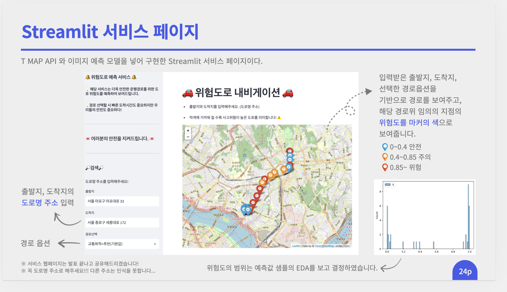

# Safe_Driving_Project
멋쟁이사자처럼 AI School 7기 final project

## 📜 Summary

## 🔍 Service

## Contributor            
|이름|역할|             
|:------:|:---:|                    
|[이승후](https://github.com/slee-02)|EDA, 모델링, PPT 제작|
|[박상우](https://github.com/junmojjang)|EDA, 모델링, 데이터수집, 발표| 
|[김준모](https://github.com/junmojjang)|EDA, 데이터수집, 모델링, Streamlit 배포|          
|[박건영](https://github.com/KYPARK93)|EDA, 데이터수집, 모델링, Streamlit 배포|            
|[전재원](https://github.com/jaewonjeon8)|EDA, 모델링, T-Map APi 구현|             
|[김영민](https://github.com/ZeroMin)|EDA, 모델링, T-Map APi 구현|           
   
