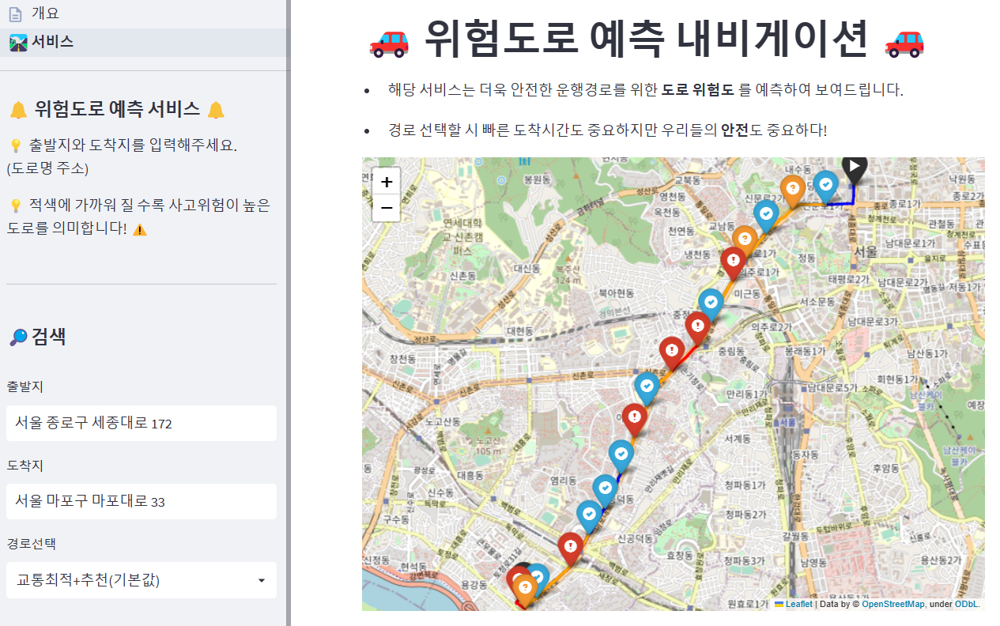

# 🚨교통사고다발지역 이미지 기반 위험도로 예측 서비스🚨
🦁 멋쟁이사자처럼 AI School 7 Final project

## 📜 Summary

## 🔍 Service

- 좌측 출발지와 도착지를 입력하면 해당 경로에 대한 **도로 위험도**를 표시하게 됩니다.
- 출발지와 도착지는 **도로명 주소**로 입력받으며 대한민국 지역이라면 어디든 입력이 가능합니다.
- 경로선택박스를 통해 고속도로, 최단거리, 어린이보호구역 등의 **다양한 경로를 선택**이 가능합니다. 
- 사용자는 해당 서비스를 이용해 가고자 하는 경로의 도로위험도를 미리 파악하고 **안전한 도로를 선택**할 수 있으며, 
  위험도로는 주의하며 안전 운전이 가능하게됩니다.

## 👨‍👨‍👧‍👧 Contributor            
|이름|역할|             
|:------:|:---:|                    
|[이승후](https://github.com/slee-02)|EDA, 모델링, PPT 제작|
|[박상우](https://github.com/junmojjang)|EDA, 모델링, 데이터수집, 발표| 
|[김준모](https://github.com/junmojjang)|EDA, 데이터수집, 모델링, Streamlit 배포|          
|[박건영](https://github.com/KYPARK93)|EDA, 데이터수집, 모델링, Streamlit 배포|            
|[전재원](https://github.com/jaewonjeon8)|EDA, 모델링, T-Map APi 구현|             
|[김영민](https://github.com/ZeroMin)|EDA, 모델링, T-Map APi 구현|           
   
#### Tableau
[https://public.tableau.com/app/profile/kunyoung.park/viz/Final_PPT/1?publish=yes](https://public.tableau.com/app/profile/kunyoung.park/viz/Final_PPT/1?publish=yes)
